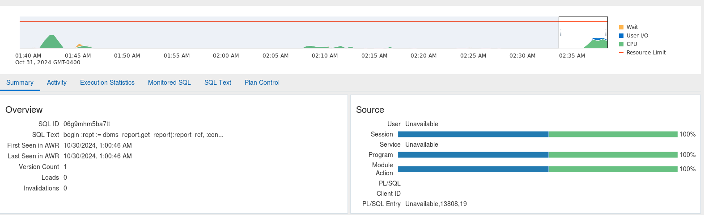
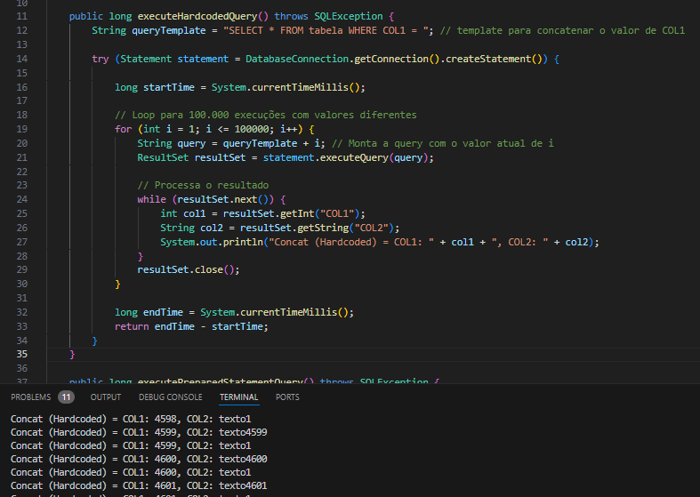

## Nome: Leonardo Adler da Silva -- Otimização de Sistemas de Banco de Dados

FATEC SÃO JOSÉ DOS CAMPOS

# Análise de Desempenho: Prepared Statements vs. Concatenation

## Objetivo
O objetivo deste laboratório foi demonstrar a eficiência dos **Prepared Statements** em comparação à concatenação de strings ao executar consultas SQL em um SGBD, especialmente no contexto do Oracle.

## Resultados dos Testes
Os testes realizados mostraram um desempenho significativo ao utilizar **Prepared Statements** em relação ao método de concatenação. Os tempos de execução das consultas foram os seguintes:

- **Tempo de Execução com Hardcoded Query (Concatenação)**: **213573 ms**
- **Tempo de Execução com Prepared Statement**: **187738 ms**

## Interpretação dos Resultados

### Otimização do Cache de Consultas
Quando um **Prepared Statement** é utilizado, o SGBD armazena o formato da consulta em cache, permitindo que a etapa de *parsing* da query seja pulada em execuções subsequentes. Apenas as variáveis das cláusulas `WHERE` são processadas, resultando em uma execução mais rápida.

### Processamento de Consultas Concatenadas
No método de concatenação, o SGBD não consegue identificar o formato da consulta previamente, o que o obriga a realizar o *parsing* da query toda vez que ela é executada. Isso contribui para um aumento significativo no tempo de execução, como evidenciado nos resultados.


### Benefícios Adicionais
Além da melhoria no desempenho, o uso de **Prepared Statements** também oferece um nível de segurança superior contra SQL injection, protegendo a aplicação contra ataques maliciosos.

### Importância para Ambientes Corporativos
Em ambientes corporativos que utilizam o SGBD Oracle, a eficiência do **Prepared Statement** pode resultar em melhorias de desempenho de 100% ou mais, dependendo da complexidade da consulta. Embora todos os SGBDs se beneficiem dessa abordagem, a intensidade da melhoria varia.

## Conclusão
Este teste simples, que envolveu apenas um parâmetro, demonstrou claramente a vantagem dos **Prepared Statements** em termos de desempenho e segurança. Com a evidência coletada, é evidente que não há motivos para implementar consultas SQL sem o uso de **Prepared Statements**, preferindo sempre evitar a concatenação de strings.



### Imagens de Suporte
- **Prints de concatenação**:
  

- **Prints de Prepared Statement**:
  
  
- **Queries prontas**:
  
  

- **API REST criada usando Spring Boot**:
  

### Retorno da API
Os resultados dos testes podem ser representados na seguinte estrutura:

```json
{
    "hardcodedQueryTime": 213573,
    "preparedStatementQueryTime": 187738
}
